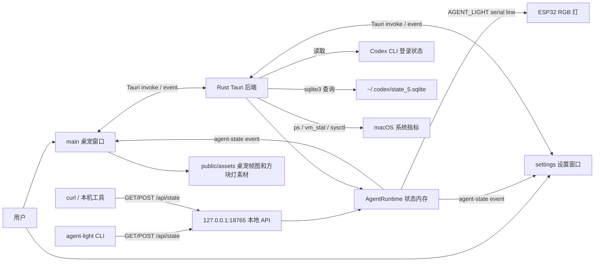
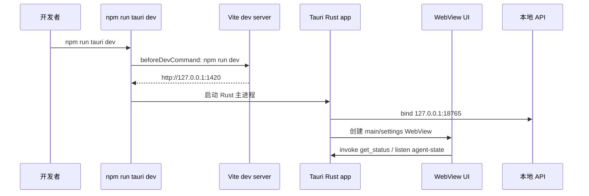
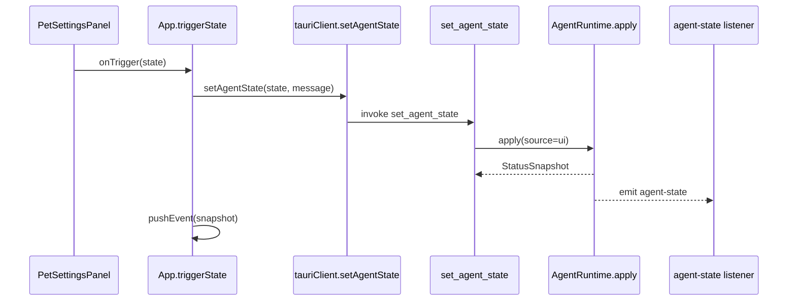
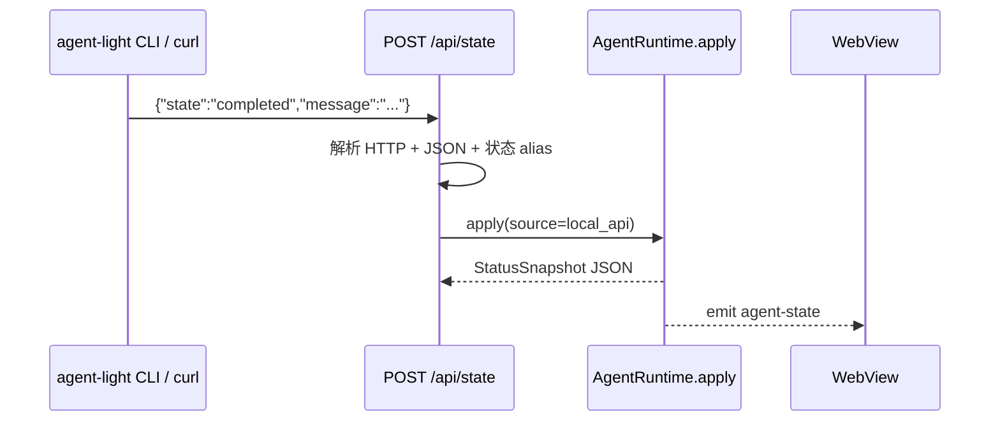
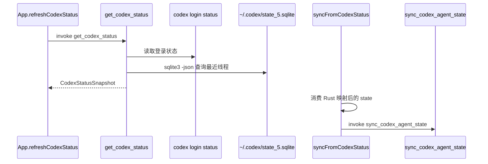
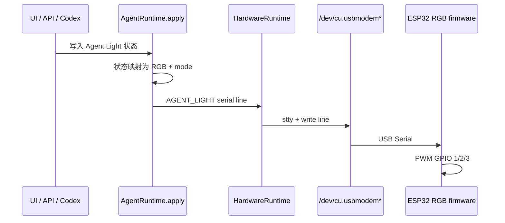

# Agent Light 技术架构

最后核对日期：2026-06-29  
适用阶段：MVP / 多用户软件 MVP 并行开发

> **2026-06-29 增补**：仓库已包含 `server/`（Fastify `:8787`）与 Win/Mac 平台层；本文第 3–5 节仍以单机 loopback 链路为主，云服与多平台细节见 `docs/specs/task.md` 与 `server/README.md`。

## 1. 文档目标

本文面向产品、设计、前端、Rust/Tauri、测试和后续硬件集成参与者，说明 Agent Light 当前实现的技术架构、边界和演进约束。

本页只描述已在仓库中看到的实现与配置。未完成或未验证的能力会明确标注为边界、风险或后续决策项，不把预留接口写成已交付能力。

## 2. 系统定位

Agent Light 是一个 macOS-first 的 Tauri v2 桌面应用，用一个透明置顶桌宠窗口表达 AI agent 工作状态。当前 MVP 提供：

- 桌面桌宠状态展示与拖拽移动。
- 设置窗口中的状态调试、Codex 本地状态摘要、系统指标摘要和小游戏占位入口。
- Tauri IPC 状态读写。
- Rust loopback 本地 HTTP API，供 CLI、curl 或其他本机工具写入状态。
- CLI 包装器 `agent-light`，通过本地 API 读写状态。
- ESP32 RGB 固件与 USB Serial 写入链路，状态变化时驱动实体 RGB 灯。

## 3. 总体架构



核心设计是“单机本地状态中枢”：

- Rust 后端中的 `AgentRuntime` 是运行期状态源。
- UI、CLI、本地 API、Codex monitor 都通过 Rust 后端收敛到同一份 `StatusSnapshot`。
- `AgentRuntime.apply()` 成功更新状态后，会把状态映射为 RGB 和模式并写入 ESP32 USB 串口。
- 前端通过 `agent-state` 事件获得变更通知，不直接持久化状态快照。
- 前端只用 `localStorage` 保存用户配置，不保存业务状态历史。

### 3.1 双 API 与云同步（2026-06 起）

除 loopback `:18765` 外，仓库另有 `server/` Fastify 服务（默认 `:8787`）：

| API | 端口 | 职责 |
| --- | --- | --- |
| Rust loopback | `18765` | 桌宠实时状态、CLI、ESP32、Codex/Cursor 本地监控 |
| Fastify 云服 | `8787` | 手机号登录、设备注册、Token 排行榜、用量持久化 |

桌面端 `sync.rs` 在登录后将 Codex/Cursor 用量排队上报云服；未登录时本地桌宠与 loopback 仍独立可用。

## 4. 技术栈

| 层 | 技术 | 当前用途 | 证据 |
| --- | --- | --- | --- |
| 桌面壳 | Tauri v2 | macOS 桌面窗口、IPC、bundle `.app` | `src-tauri/tauri.conf.json`、`src-tauri/Cargo.toml` |
| 后端 | Rust 2021 + Tauri commands | 状态运行时、本地 API、窗口控制、系统/Codex 数据读取 | `src-tauri/src/main.rs` |
| 前端 | React 19 + TypeScript | 桌宠、设置面板、状态编排 | `src/App.tsx`、`src/components/**` |
| 构建 | Vite 7 + TypeScript 5.9 | dev server、前端 build | `package.json` |
| 测试 | Vitest 4 + cargo test | 前端域、shared、server、Rust 单测 | `vitest.config.ts`、`npm run test:all`、`src-tauri/` |
| 云服 | Fastify 5 + MySQL + Drizzle | 多用户 auth、排行榜、用量 | `server/`、`compose.yaml` |
| CLI | Node.js ESM | 本机命令行状态读写 | `bin/agent-light.mjs` |
| 资源 | PNG 帧图 | 桌宠动画和虚拟硬件方块 | `public/assets/**` |
| 固件 | Arduino-ESP32 | ESP32 Mini RGB LED 控制 | `firmware/agent_light_esp32_rgb/**` |

配置版本以 `package.json`、`Cargo.toml` 和 Tauri 配置为准；本文不声明本机全局 Node/Rust 工具链版本。

## 5. 仓库模块地图

| 模块 | 路径 | 职责 |
| --- | --- | --- |
| React 入口 | `src/main.tsx`、`src/App.tsx` | 前端启动、视图选择、状态轮询、配置保存、事件分发 |
| 状态域 | `src/domain/status.ts` | 状态枚举、文案、颜色、alias、消息清洗、fallback event |
| Tauri 客户端 | `src/tauriClient.ts` | 封装 Tauri `invoke`/`listen`/window API，并提供浏览器预览 fallback |
| 桌宠组件 | `src/components/AgentPet.tsx` | 帧动画、点击/拖拽、完成确认、虚拟硬件方块显示 |
| 设置面板 | `src/components/PetSettingsPanel.tsx` | 状态测试、运行概览、窗口开关、最近事件、小游戏占位 |
| ESP32 固件 | `firmware/agent_light_esp32_rgb/` | USB Serial 行协议、GPIO 1/2/3 PWM、RGB 动画 |
| Rust 主进程 | `src-tauri/src/main.rs` | Tauri commands、本地 API、状态运行时、系统指标、Codex 状态、ESP32 串口写入 |
| Tauri 配置 | `src-tauri/tauri.conf.json` | 窗口、CSP、dev/build 命令、bundle 配置 |
| Capability | `src-tauri/capabilities/default.json` | 主窗口和设置窗口可用的 Tauri 权限 |
| CLI | `bin/agent-light.mjs` | `status`/`state` 命令，调用 loopback API |
| 文档 | `docs/**` | spec、验收、开发、API、测试、发布、运行手册 |

## 6. 运行形态

### 6.1 Tauri 开发态



关键配置：

- Vite dev server 固定为 `http://127.0.0.1:1420`。
- Rust 本地 API 固定为 `127.0.0.1:18765`。
- Tauri `beforeDevCommand` 会启动 `npm run dev`。

### 6.2 浏览器预览态

直接执行 `npm run dev` 时，前端会运行在普通浏览器。`src/tauriClient.ts` 通过 `window.__TAURI_INTERNALS__` 判断是否处于 Tauri runtime：

- 不在 Tauri 中：返回 fallback 状态、fallback window label、fallback placement、浏览器预览 Codex 状态。
- 在 Tauri 中：调用真实 Tauri commands 和 window API。

浏览器预览只验证前端 fallback 和基本 UI，不验证 WebView、窗口权限、Rust 本地 API、系统指标或 Codex 本机读取。

### 6.3 构建态

Tauri build 配置为：

- `beforeBuildCommand`: `npm run build`
- `frontendDist`: `../dist`
- bundle target: `app`
- bundle category: `DeveloperTool`

当前发布文档把 DMG、签名和公证列为后续 release 阶段事项；不能把本地 dev 成功等同于可分发安装包完成。

## 7. 窗口与进程模型

| Window label | 角色 | 关键配置 | 行为 |
| --- | --- | --- | --- |
| `main` | 桌宠窗口 | 300x300、透明、无装饰、置顶、跳过任务栏、不可调整尺寸 | 显示桌宠和虚拟方块，支持拖拽移动；接近屏幕顶部时隐藏虚拟方块 |
| `settings` | 设置窗口 | 760x560、普通装饰、居中、默认隐藏、不可调整尺寸 | 展示控制台、运行概览、窗口开关、最近事件、小游戏占位 |

窗口相关 Tauri 权限集中在 `src-tauri/capabilities/default.json`：

- `core:default`
- `core:window:allow-start-dragging`
- `core:window:allow-set-always-on-top`
- `core:window:allow-show`
- `core:window:allow-hide`
- `core:window:allow-close`
- `core:window:allow-set-focus`

窗口交互链路：

- 桌宠点击：非完成态打开设置窗口；完成态确认后回到待命。
- 桌宠拖拽：前端触发 `startDragging()`，拖动结束后调用 `snap_main_window_to_top`。
- 顶部吸附：Rust 根据主窗口 y 坐标与 monitor top 判断 `near_top`，前端用它决定是否显示虚拟硬件方块。

## 8. 状态模型

### 8.1 状态枚举

| 状态 | 中文含义 | 默认视觉 | 动画模式 | alias |
| --- | --- | --- | --- | --- |
| `standby` | 待命中 | 蓝色 | breathe | `idle` |
| `working` | 工作中 | 黄色 | steady | `running` |
| `completed` | 已完成 | 绿色 | repeat_pulse（一亮一灭） | `success` |
| `attention` | 需处理 | 红色 | pulse（一亮一灭） | `error`、`needs_action` |

前后端都接受 legacy alias，但响应统一使用标准状态值。

### 8.2 状态快照

Rust `StatusSnapshot` 字段：

| 字段 | 类型 | 含义 |
| --- | --- | --- |
| `state` | `AgentStatus` | 标准状态值 |
| `message` | `Option<String>` | 可选状态说明；Rust 限制最长 180 字符 |
| `source` | `String` | 来源，例如 `boot`、`ui`、`local_api`、`codex_monitor` |
| `sequence` | `u64` | Rust 运行时递增序号 |
| `timestamp_ms` | `u128` | Unix epoch 毫秒 |

前端 `AgentStatusEvent` 与该结构保持同形，用于 UI 渲染、日志和灯效映射。

### 8.3 状态来源优先关系

当前没有显式优先级队列；最后写入 `AgentRuntime.apply()` 的来源成为当前状态。来源包括：

- `boot`: Rust 初始状态。
- `ui`: 设置面板状态按钮或完成态确认。
- `local_api`: `POST /api/state`。
- `codex_monitor`: 前端轮询 Codex 状态后通过 Tauri command 同步。
- `fallback`: 浏览器预览或异常兜底。

这个设计适合 MVP 调试，但后续如果接入真实硬件、多个 agent 或后台任务，需要补充冲突策略和状态所有权规则。

## 9. 核心数据流

### 9.1 UI 写状态



### 9.2 CLI / curl 写状态



### 9.3 Codex 本地状态同步



当前 Codex 判断规则：

- 只读取用户主线程；`thread_source='subagent'`、`codex-auto-review` 和 guardian 子线程不参与状态判定。
- 会话尾部仍是 function call、tool output、reasoning 或 commentary 时，视为 `working`。
- 会话尾部是最近的 final assistant message 时，视为 `completed`。
- 无法识别会话尾部时，最近线程更新时间距离采样时间不超过 `CODEX_ACTIVE_WINDOW_SECONDS` 才保守视为 `working`。
- 不可用且没有本地线程时，视为 `attention`。
- 前端不再用“曾经 working 后变 idle”的超时逻辑自行同步 `completed`，避免 Codex 仍在思考时误写绿色灯。
- 当前已是 completed 时保留完成提醒，直到用户点击确认或其他来源写入状态。
- UI 或 local API 手动写入状态后，Rust 运行时保留 15 秒手动窗口；窗口内 `codex_monitor` 写入直接返回当前状态，避免手工硬件测试被自动同步抢占。

### 9.4 ESP32 RGB 硬件写入



硬件写入是 best-effort：串口未发现、打开失败或写入失败时只更新 `last_error`，不阻断桌宠 UI、本地 API 或 CLI 的状态更新。

## 10. Rust 后端架构

### 10.1 状态运行时

`AgentRuntime` 包含：

- `current: Arc<Mutex<StatusSnapshot>>`
- `sequence: Arc<AtomicU64>`
- `hardware: HardwareRuntime`
- `manual_hold_until_ms: Arc<AtomicU64>`

所有状态写入经过 `apply()`：

1. 若来源是 `codex_monitor` 且仍处于手动保持窗口，直接返回当前快照。
2. 递增 `sequence`。
3. 清洗 `message`。
4. 更新 `current`。
5. UI 或 local API 写入时刷新手动保持窗口。
6. 通过 `app.emit("agent-state", snapshot)` 广播给前端。
7. 调用 `HardwareRuntime.apply()` 写入 ESP32 RGB 串口。
8. 返回新快照给调用方。

### 10.2 Tauri commands

| Command | 职责 |
| --- | --- |
| `get_status` | 读取当前状态 |
| `set_agent_state` | UI 来源写状态 |
| `sync_codex_agent_state` | Codex monitor 来源写状态 |
| `open_settings_window` | 显示并聚焦设置窗口 |
| `hide_settings_window` | 隐藏设置窗口 |
| `get_main_window_placement` | 读取主窗口位置和 near_top |
| `move_main_window` | 移动主窗口 |
| `snap_main_window_to_top` | 顶部阈值内吸附到 monitor top |
| `get_system_metrics` | 读取 CPU、内存、开机时长 |
| `get_codex_status` | 读取本地 Codex 登录和最近线程摘要 |
| `get_hardware_status` | 读取 ESP32 RGB 硬件连接快照 |

### 10.3 本地 HTTP API

Rust 在 setup 阶段启动一个后台线程，绑定 `127.0.0.1:18765`。当前没有使用 Web 框架，而是用 `TcpListener` 和手写 HTTP 解析器处理最小 API。

| Method | Path | 行为 |
| --- | --- | --- |
| `GET` | `/api/state` | 返回当前 `StatusSnapshot` |
| `POST` | `/api/state` | 写入状态，来源为 `local_api` |
| `OPTIONS` | `/api/state` | CORS 预检，返回 204 |
| `GET` | `/api/codex` | 返回 `CodexStatusSnapshot` |
| `GET` | `/api/hardware` | 返回 `HardwareStatusSnapshot` |

API 约束：

- body 上限 `MAX_BODY_LEN = 4096` bytes。
- 读超时 2 秒。
- `Access-Control-Allow-Origin: *`，但服务只绑定 loopback。
- 状态 JSON 使用 Rust `AgentStatus` 反序列化，支持 alias。
- 硬件状态 API 是只读快照，不接收外部硬件写入参数。
- 未知路径返回 404，并提示使用 `POST /api/state`。

安全边界：该 API 设计为本机调试和集成入口，不是公网服务。若后续开放网络或跨进程权限扩大，需要新增认证、来源校验和威胁模型。

### 10.4 系统与 Codex 读取

系统指标来自固定 macOS 命令：

- CPU：`/bin/ps -A -o %cpu=`
- 内存：`/usr/bin/vm_stat` + `sysctl hw.memsize`
- 开机时长：`/usr/sbin/sysctl -n kern.boottime`

Codex 摘要来自：

- Codex binary 候选路径：`/Applications/Codex.app/Contents/Resources/codex`、`/opt/homebrew/bin/codex`、`/usr/local/bin/codex`
- 登录状态命令：`codex login status`
- 本地状态库：`~/.codex/state_5.sqlite`
- 查询工具：`/usr/bin/sqlite3 -json`

这些读取都是 best-effort：命令不存在、数据库不存在或解析失败时返回不可用/空摘要，而不是阻断桌宠运行。

### 10.5 ESP32 串口写入

`HardwareRuntime` 由环境变量配置：

| 环境变量 | 作用 |
| --- | --- |
| `AGENT_LIGHT_HARDWARE=0` | 关闭硬件写入 |
| `AGENT_LIGHT_SERIAL_PORT` | 指定 ESP32 串口路径 |
| `AGENT_LIGHT_SERIAL_BAUD` | 指定 baud，默认 `115200` |

自动发现串口顺序：

1. `/dev/cu.usbmodem*`
2. `/dev/cu.usbserial*`
3. `/dev/tty.usbmodem*`
4. `/dev/tty.usbserial*`

串口写入格式见 [ESP32 RGB 硬件规格](../specs/esp32-rgb-hardware.md)。当前实现使用 macOS `/bin/stty` 配置串口，跨平台未支持。

## 11. 前端架构

### 11.1 App 编排

`src/App.tsx` 是前端编排中心：

- 根据 URL query 和 window label 切换 `main` / `settings` 视图。
- 读取和保存 `agent-light-config-v1` 到 `localStorage`。
- 启动时读取 `get_status` 并订阅 `agent-state`。
- 每 700ms 读取窗口位置，用于判断虚拟硬件方块是否显示。
- 每 5000ms 读取系统指标。
- 每 5000ms 读取 Codex 状态并同步为 agent 状态。
- 每 5000ms 读取 ESP32 RGB 硬件状态，并在状态变化后延迟刷新一次。
- 保存最近 5 条状态事件日志。

### 11.2 Tauri 客户端边界

`src/tauriClient.ts` 是前端访问本机能力的唯一封装层。它提供两类能力：

- Tauri runtime 中：调用 `invoke`、`listen`、`getCurrentWindow()`。
- 浏览器预览中：返回 fallback 数据，并通过 `window.history` 和自定义事件模拟设置页切换。

这使前端 UI 可以在浏览器中预览，但所有本机能力仍必须在 Tauri 中验证。

### 11.3 UI 组件

| 组件 | 输入 | 输出 / 行为 |
| --- | --- | --- |
| `AgentPet` | `state`、`speed`、`showHardwareBlock`、交互回调 | 根据状态播放不同 PNG 帧；拖动触发窗口移动；点击完成态确认 |
| `PetSettingsPanel` | 当前状态、配置、系统指标、Codex 摘要、日志 | 渲染控制台、状态测试按钮、运行概览、窗口开关和小游戏占位 |

### 11.4 资源加载

桌宠和虚拟硬件方块资源通过固定路径加载：

- `/assets/pet-frames/{state}-{index}.png`
- `/assets/hardware-cube-{state}.png`

`AgentPet` 中的 `assetVersion` 用 query string 做浏览器缓存刷新。资源是否存在和帧数是否匹配会直接影响桌宠渲染，应纳入视觉回归或冒烟检查。

## 12. 本地配置与持久化

当前没有数据库，也没有持久化状态历史。

前端 `localStorage` key：

```text
agent-light-config-v1
```

字段：

| 字段 | 默认值 | 当前作用 |
| --- | --- | --- |
| `alwaysOnTop` | `true` | 设置窗口开关会调用当前窗口 `setAlwaysOnTop` |
| `launchAtLogin` | `false` | 仅 UI 与 localStorage 配置存在，未见系统开机启动实现 |

注意：`alwaysOnTop` 当前调用 `getCurrentWindow().setAlwaysOnTop()`，在设置窗口内切换时影响的是当前窗口；主桌宠窗口初始置顶仍来自 Tauri 配置。若要做全局窗口策略，需要补 spec 并梳理 main/settings 的目标窗口。

## 13. 安全与权限边界

已实现边界：

- Tauri `withGlobalTauri` 为 `false`。
- CSP 限制 `default-src 'self'`，仅允许连接 `http://127.0.0.1:18765`。
- Tauri capability 只开放窗口相关基础能力。
- 本地 API 绑定 loopback 地址。
- API body 长度限制为 4096 bytes。
- ESP32 串口写入只从本机进程发起，不开放网络设备控制。

仍需注意：

- 本地 API 无认证；同机进程都可写状态。
- CORS 允许所有 origin，但服务只绑定 `127.0.0.1`。如果未来改为非 loopback，必须重新设计权限。
- Codex 状态读取依赖本机路径、SQLite schema 和 CLI 输出格式，属于易变集成点。
- ESP32 串口协议无认证；边界是本机 USB 设备，若未来改为网络或 BLE 需要重做威胁模型。
- `macOSPrivateApi` 已开启，release 前需要复核签名、公证和权限行为。

## 14. 测试与验证入口

当前测试配置：

- `npm run test` -> `vitest run`
- test include: `src/**/*.test.ts`

已覆盖方向：

- `src/domain/status.test.ts`：状态值、alias、颜色、消息清洗、fallback event。

建议按风险补充：

- Rust 本地 API 的正/负向测试：JSON、alias、body 长度、未知路径。
- ESP32 串口写入测试：自动发现、指定端口、断连、写入失败和 `/api/hardware` 快照。
- ESP32 固件编译和板级冒烟：`PING`、四状态颜色、动画模式。
- Tauri 窗口行为冒烟：设置窗口显示/隐藏、主窗口拖拽和顶部吸附。
- Codex best-effort 读取：CLI 不存在、SQLite 不存在、线程新旧判断。
- 资源完整性检查：每个状态对应帧图和硬件方块存在。
- release build 冒烟：`.app` 首启、本地 API bind、CLI 状态写入。

## 15. 发布与运维架构

当前发布目标是 macOS `.app` bundle：

- `npm run build` 生成前端 `dist`。
- `npm run tauri build` 生成 Tauri app bundle。
- `docs/operations/release.md` 记录 release 检查项。
- `docs/operations/runbook.md` 记录本地运行、API 验证和常见故障。

当前未完成或未验证：

- DMG 包。
- 代码签名。
- notarization。
- 开机启动。
- ESP32 板级灯效验收记录。
- release 安装后的 CLI 分发路径。

## 16. 架构决策与后续演进

### 16.1 已定方向

- 采用 spec 模式开发，先更新规格和验收矩阵，再实现。
- 真实硬件第一阶段采用 ESP32 Mini + USB Serial + RGB LED。
- 本地集成入口优先 loopback API 和 CLI，方便 Codex、脚本和手动调试接入。
- 前端保留浏览器 fallback，但本机能力以 Tauri 验证为准。

### 16.2 待决策项

| 主题 | 当前状态 | 需要决策 |
| --- | --- | --- |
| 真实硬件 | ESP32 USB Serial 已实现源码，板级未验收 | 芯片/board revision、GPIO 1/3 串口冲突、实机刷写和灯效记录 |
| 状态冲突 | 最后写入 wins | Codex monitor、用户手动、外部 API 的优先级和锁定规则 |
| 本地 API 安全 | loopback + 无认证 | 是否需要 token、origin 限制、随机端口或 socket |
| 开机启动 | UI 配置存在，系统实现未见 | Tauri plugin、LaunchAgent 或 macOS 登录项策略 |
| 设置持久化 | localStorage | 是否需要 Rust-side config 文件、迁移和备份 |
| Codex 集成 | 读取本机 CLI/SQLite | schema 兼容、失败降级、用户隐私展示范围 |
| 测试策略 | 前端域单测为主 | Rust/API/Tauri 端到端验证怎么落地 |

## 17. 影响面检查清单

改动前按类型检查以下影响面：

| 改动类型 | 必查文件 / 行为 |
| --- | --- |
| 新增状态 | `src/domain/status.ts`、`src-tauri/src/main.rs`、`bin/agent-light.mjs`、`AgentPet` 帧图、设置面板、测试、API 文档 |
| 改本地 API | Rust `handle_connection`、CLI、README/API 文档、runbook、CSP、负向测试 |
| 改窗口行为 | Tauri config、capabilities、`tauriClient.ts`、`App.tsx`、手动 Tauri 验证 |
| 改 Codex 同步 | Rust `read_codex_status`、前端 `syncFromCodexStatus`、设置面板展示、隐私和失败降级 |
| 改持久化配置 | `App.tsx` storage schema、设置面板、迁移策略、开发/运行文档 |
| 接入硬件 | `src-tauri/src/main.rs`、`firmware/agent_light_esp32_rgb/**`、权限、设备发现、错误状态、spec 和验收矩阵 |
| 改资源帧图 | `public/assets/**`、`AgentPet` frame 列表、视觉冒烟、缓存版本 |

## 18. 证据索引

| 结论 | 证据 |
| --- | --- |
| 项目是 Tauri v2 + React/TS + Vite | `package.json`、`src-tauri/tauri.conf.json` |
| Rust 后端管理状态、窗口、本地 API、系统和 Codex 读取 | `src-tauri/src/main.rs` |
| 主窗口透明置顶、设置窗口默认隐藏 | `src-tauri/tauri.conf.json` |
| 前端有浏览器 fallback | `src/tauriClient.ts` |
| 状态枚举和 alias | `src/domain/status.ts`、`src-tauri/src/main.rs`、`bin/agent-light.mjs` |
| CLI 通过 loopback API 读写状态 | `bin/agent-light.mjs` |
| 当前只持久化 UI 配置 | `src/App.tsx` |
| ESP32 RGB 串口硬件链路存在 | `src-tauri/src/main.rs`、`firmware/agent_light_esp32_rgb/agent_light_esp32_rgb.ino` |
| 本地 API body 上限和 CORS | `src-tauri/src/main.rs` |
| Tauri 权限范围 | `src-tauri/capabilities/default.json` |
| 测试入口 | `vitest.config.ts`、`src/**/*.test.ts` |
